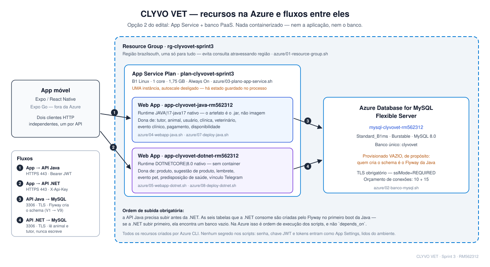

# CLYVO VET — Backend Java

API REST em Spring Boot para o CLYVO VET, plataforma de saúde contínua para pets.
Challenge FIAP 2026 — 2º ano ADS.

**Stack:** Java 17 · Spring Boot 3.5 · Spring Security (JWT) · JPA/Hibernate 6.6 ·
Flyway · Oracle 19c / MySQL / H2 · OpenAPI 3

---

## Descrição da Solução

O histórico clínico de um animal fica espalhado entre as clínicas que já o
atenderam. Quando o tutor troca de veterinário, ou chega numa emergência, quem vai
atender não sabe de alergia, condição crônica ou medicação em uso — e o tutor nem
sempre lembra.

O **CLYVO VET** resolve isso invertendo a posse do prontuário: o histórico pertence
ao **tutor**, não à clínica. Todo atendimento de qualquer clínica vai para o mesmo
prontuário do animal, o tutor decide quem pode ver o quê, e todo acesso fica
auditado.

Esta API é o backend principal da plataforma. Ela cobre identidade e autenticação,
o núcleo clínico (tutores, animais, clínicas, veterinários, prontuário), a agenda
com verificação de disponibilidade e bloqueios, a cobrança, e o mecanismo de
consentimento que é o diferencial do produto. São **84 endpoints** sob `/api/v1`.

O acesso ao histórico tem três níveis:

| Nível | Quem vê | O que vê |
|---|---|---|
| 0 · Operacional | quem tem agendamento | nome, espécie, raça, porte |
| 1 · Resumo de segurança | qualquer veterinário autenticado, **sempre** | alergia, condição crônica, medicação contínua, vacina, último peso |
| 2 · Histórico completo | **só com consentimento do tutor** | linha do tempo, laudos, desfechos |

O nível 1 existe por decisão clínica: negar informação de alergia numa emergência é
pior do que expor um dado. E há **quebra de vidro** — acesso emergencial sem
consentimento, que exige justificativa, notifica o tutor e fica registrado; uso
recorrente pelo mesmo profissional gera alerta.

O sistema é consumido por um **aplicativo móvel** em React Native/Expo e
complementado por uma **API .NET** de engajamento (lembretes, sugestão de produtos,
widget de saúde preditiva), que compartilha o mesmo banco.

---

## Benefícios para o Negócio

| Problema hoje | O que a solução traz |
|---|---|
| O prontuário se perde a cada troca de clínica, e o tutor vira o transporte de informação | O histórico é único e acompanha o animal. A clínica recebe o paciente já com contexto na primeira consulta |
| Numa emergência, quem atende decide sem saber de alergia ou medicação em uso | O resumo de segurança é visível a qualquer veterinário autenticado, sem depender de autorização prévia |
| Compartilhar prontuário hoje é tudo ou nada, e sem rastro | Três níveis de acesso e trilha de auditoria: o tutor sabe quem leu o histórico do animal dele, e quando |
| Falta agendada esquecida e retorno não remarcado são perda de receita invisível | Agenda com disponibilidade real, marcação de falta e vínculo retorno → consulta de origem, o que torna a taxa de retorno calculável |
| Vacina e medicação contínua dependem da memória do tutor | Lembretes automáticos pela API de engajamento, ligados ao animal |

**Para a clínica**, o ganho é receber o paciente com prontuário completo em vez de
começar do zero. **Para o tutor**, é deixar de ser o responsável por lembrar e
transportar a informação clínica do próprio animal.

---

## Integrantes do Grupo

| Nome | RM |
|---|---|
| Fabrício Henrique Pereira | RM 563237 |
| Leonardo José Pereira | RM 563065 |
| Miguel Henrique Oliveira Dias | RM 565492 |
| Pedro Henrique de Oliveira | RM 562312 |

---

## Começando

Para rodar localmente **não é preciso configurar nada** — o perfil `dev` sobe um H2
em memória, aplica as migrations e cria usuários de teste:

```bash
git clone https://github.com/Clyvovet-Challenge/clyvovet-backend-java.git
cd clyvovet-backend-java
./mvnw spring-boot:run -Dspring-boot.run.profiles=dev
```

A aplicação sobe em `http://localhost:8080` e o Swagger fica em
`http://localhost:8080/swagger-ui.html`.

> ⚠️ O perfil ativo por padrão é `oracle`, não `dev`. Rodar `./mvnw spring-boot:run`
> sem argumento faz a aplicação tentar conectar no Oracle da FIAP e falhar se as
> variáveis de ambiente não estiverem definidas.

### A API exige autenticação

Todos os endpoints de domínio pedem um token JWT. O
[`DevDataSeeder`](src/main/java/br/com/fiap/clyvovet/config/DevDataSeeder.java)
semeia estes usuários — as senhas valem apenas em desenvolvimento:

| E-mail | Senha | Perfil | Alcance |
|---|---|---|---|
| `admin@clyvovet.com` | `admin12345` | `ADMIN` | a plataforma inteira: clínicas, acessos, auditoria |
| `gestor.vetcare@clyvovet.com` | `gestor12345` | `ADMIN_CLINICA` | só a VetCare — agenda, equipe, catálogo, a receber |
| `camila.ferreira@vetcare.com.br` | `vet12345` | `VETERINARIO` | só os próprios atendimentos, na VetCare |
| `lucas.santos@email.com` | `tutor12345` | `TUTOR` | só os próprios pets |
| `maria.oliveira@email.com` | `tutor12345` | `TUTOR` | só os próprios pets (outro dono, para testar o isolamento) |

O gestor e a veterinária são da **mesma clínica** de propósito: é o par que
demonstra o escopo transitivo `usuario -> veterinario -> clinica`, e que um não
alcança o que é do outro.

**Em quais perfis a semeadura roda:** `dev`, `h2`, `oracle` e `local`. O perfil
`mysql` — o de produção — está fora da lista de propósito, para que o banco de
entrega não receba credencial de desenvolvimento. Quem sobe o stack do Docker
precisa então de `SPRING_PROFILES_ACTIVE=mysql,local`: `mysql` traz a conexão,
`local` traz os usuários. Só `mysql` faz a API subir certinho e todo login
responder **401**, porque não há usuário nenhum no banco.

O registro público (`POST /api/v1/auth/registrar`) cria apenas `TUTOR`. Os outros
três perfis existem por esta semeadura ou pela criação manual via `ADMIN`.

Obtenha um token e use-o no cabeçalho `Authorization`:

```bash
# Devolve {"accessToken": "...", "refreshToken": "...", ...}
curl -X POST http://localhost:8080/api/v1/auth/login \
  -H 'Content-Type: application/json' \
  -d '{"email":"admin@clyvovet.com","senha":"admin12345"}'

curl http://localhost:8080/api/v1/animais \
  -H 'Authorization: Bearer <accessToken>'
```

Sem o cabeçalho, a resposta é **401**. Com um token de perfil insuficiente, **403**.

### Outros perfis

| Perfil | Banco | Quando usar |
|---|---|---|
| `dev` | H2 em memória | desenvolvimento local — **recomendado** |
| `h2` | H2 em modo servidor | dentro do docker-compose (o host `clyvovet-db` só existe lá) |
| `oracle` | Oracle 19c FIAP | entrega e banco de testes |
| `mysql` | Azure Database for MySQL | alvo do deploy — [ainda não validado](docs/07-pendencias-e-divergencias.md) |

Os perfis `oracle` e `mysql` não têm credenciais no código: elas vêm do ambiente, e a
aplicação não sobe sem elas.

```bash
export DB_USERNAME=rm000000
export DB_PASSWORD=sua-senha
export JWT_SECRET=$(openssl rand -base64 32)

./mvnw spring-boot:run -Dspring-boot.run.profiles=oracle
```

O schema é criado e versionado pelo **Flyway** — não é preciso rodar SQL à mão. O
`src/main/resources/db/db-oracle.sql` é o DDL original e hoje serve só como
referência histórica. Detalhes em [`docs/04-configuracao.md`](docs/04-configuracao.md).

---

## Arquitetura

```
┌─────────────┐    HTTP + Bearer JWT    ┌────────────────────────────────┐
│  Front-end  │ ──────────────────────► │   Spring Boot API (8080)       │
│  / Mobile   │                         │                                │
└─────────────┘                         │   JwtAuthenticationFilter      │
                                        │   Controller                   │
                                        │   Service (cache + ownership)  │
                                        │   Repository (JPA)             │
                                        │   Entity                       │
                                        └───────────────┬────────────────┘
                                                        │  Flyway
                                        ┌───────────────▼────────────────┐
                                        │  Oracle 19c · MySQL · H2       │
                                        └────────────────────────────────┘
```

Cada requisição passa pelo filtro JWT antes de chegar ao controller. Além do perfil,
há uma regra de **ownership**: um tutor só enxerga os próprios pets — inclusive no
cache, cuja chave inclui o `tutorId`.

---

## Funcionalidades

São **84 endpoints** em 16 controllers. O que os separa não é o volume: **36 são
CRUD** — seis operações sobre cada um dos seis recursos —, e os outros **48 são
autenticação e regra de negócio**: fluxos que consultam o estado do domínio e
recusam com um motivo.

A regra do Challenge é explícita sobre isso: *"a implementação apenas de operações
de CRUD não será considerada suficiente"*. A Sprint 3 pede dois fluxos completos;
existem quatro.

### CRUD e autenticação

Seis recursos de domínio — **tutores, animais, clínicas, veterinários, eventos
clínicos e pagamentos** — com listagem paginada e dois filtros cada, busca por id,
POST, PUT, PATCH e DELETE.

Autenticação por **JWT**: access de 15 min, refresh de 7 dias com revogação,
lockout de conta após tentativas falhas e rate limit por IP.

### Os quatro fluxos de negócio

Um **fluxo** aqui é uma operação que não é CRUD: ela consulta o estado do domínio,
decide, e recusa com um motivo. Cada um tem uma letra, herdada da
[spec 08](specs/08-modelo-de-negocio.md), que aparece nos nomes das regras
(`A10`, `R7`, `C22`, `P13`) e nos comentários do código.

| Fluxo | Nome | Pergunta que ele responde |
|---|---|---|
| **A** | Agendamento | *Este horário pode ser marcado para este pet?* — cruza catálogo, grade, bloqueios e atendimentos já marcados |
| **R** | Retorno e falta | *Quem devia ter voltado e não voltou?* — fecha o atendimento e cobra a continuidade do cuidado |
| **C** | Consentimento e histórico | *Quanto deste prontuário esta pessoa pode ver?* — três níveis de acesso, auditados |
| **P** | Pagamento e cobrança | *Quanto foi cobrado, quanto entrou, quanto falta?* — máquina de estados, não campo editável |

A letra **C** é de *consentimento*, e a **P** de *pagamento* — as duas nomeiam a
decisão central do fluxo, não o substantivo do endpoint.

#### Fluxo A — Agendamento pelo tutor

O tutor era o único perfil que **não** podia criar atendimento. Agora ele marca a
própria consulta — e o sistema decide se pode.

```
GET  /api/v1/agendamentos/vagas          vagas livres no período
POST /api/v1/agendamentos                marca a consulta
POST /api/v1/agendamentos/{id}/cancelar  motivo obrigatório
GET  /api/v1/agendamentos/meus
```

Entre a entrada e a gravação há uma decisão que atravessa **sete entidades**: o
serviço está ativo? o veterinário atende nessa clínica? há antecedência mínima? o
horário cai na grade? colide com bloqueio? colide com outro atendimento? O evento
nasce `AGENDADO`, com o preço vindo do catálogo.

A busca de vagas devolve o que **pode** ser marcado, já descontando grade,
bloqueio e colisão — é a consulta que um calendário consome.

#### Fluxo R — Retorno e falta

Responde ao tema do Challenge — continuidade do cuidado. O modelo episódico
registra que a consulta aconteceu; este fluxo registra que ela **devia ter tido
sequência e não teve**.

```
POST /api/v1/eventos-clinicos/{id}/concluir      peso, desfecho, retorno previsto
POST /api/v1/eventos-clinicos/{id}/retorno       ligado à consulta de origem
GET  /api/v1/eventos-clinicos/retornos-vencidos  os pets que sumiram
POST /api/v1/eventos-clinicos/marcar-faltas      varredura
```

A conclusão é o **único** caminho para `REALIZADO` — o status não é editável por
PATCH, senão um `{"statusEvento":"REALIZADO"}` marcaria como feito um atendimento
futuro. Variação de peso acima de 20% volta como **aviso na resposta**, nunca como
bloqueio: um filhote que sai de 2 kg para 3 kg está saudável, e quem distingue é o
veterinário.

A lista de vencidos traz nome e telefone do tutor porque ela existe para virar
ligação.

#### Fluxo C — Consentimento e histórico clínico

O acesso ao prontuário deixou de ser tudo-ou-nada.

| Nível | Quem alcança | O que vê |
|---|---|---|
| **0** operacional | quem tem agendamento | nome, espécie, raça, porte, idade |
| **1** resumo de segurança | qualquer veterinário autenticado | alergias, condições crônicas, medicação contínua, vacinas, último peso, contato |
| **2** histórico completo | só com consentimento do tutor | linha do tempo, laudos, desfechos, dados do tutor |

**Busca de clínica.** `GET /clinicas?busca=` cruza **nome, bairro, cidade e
estado** com OR — é a caixa única da tela de atendimento do app, onde o tutor
digita "VetCare", "Pinheiros" ou "São Paulo" sem precisar saber qual dos três
ele escreveu. Os filtros `nome` e `cidade` continuam separados, para quem
integra por eles.

```
GET  /api/v1/animais/resumo?microchip=          nível 1
GET  /api/v1/animais/{id}/historico             nível conforme o solicitante
POST /api/v1/animais/{id}/acesso-emergencial    quebra de vidro
GET  /api/v1/animais/{id}/acessos               quem leu, e quando
GET  /api/v1/autorizacoes/minhas
POST /api/v1/autorizacoes/{id}/revogar
POST /api/v1/animais/{id}/alertas

GET    /api/v1/animais/{id}/documentos                    anexos (sem o arquivo)
POST   /api/v1/animais/{id}/documentos                    multipart: arquivo + titulo
GET    /api/v1/animais/{id}/documentos/{docId}/arquivo    os bytes
DELETE /api/v1/animais/{id}/documentos/{docId}
```

**Os anexos seguem a autorização do histórico, não uma própria.** Ler um laudo
exige **nível 2** — o nível 1 é curto de propósito e um PDF não tem versão
curta. O veterinário sem consentimento usa a quebra de vidro, que passa a
liberar o arquivo pelo resto do dia: a liberação **é** o registro dela.

Baixar um arquivo aparece em `GET /animais/{id}/acessos`, como aparece a leitura
do histórico. Não há porta por onde ler o prontuário sem deixar rastro.

O arquivo vive em `LONGBLOB` na própria tabela (V17), com teto de 8 MB e lista
fechada de tipos (PDF, JPG, PNG) verificada **pelos bytes do arquivo**, não pelo
`Content-Type` que o cliente declara. `clyvovet.documentos.habilitado=false`
apaga as quatro rotas do contexto sem tocar no resto da API.

**O microchip identifica; nunca autoriza.** Ele está impresso na carteira de
vacinação e qualquer leitor de pet shop o lê — quem credencia o nível 1 é a
autenticação do veterinário.

O consentimento do nível 2 nasce **no próprio agendamento**, sem ciclo de pedir e
aprovar, e vale 2 anos após o último atendimento naquela clínica: quem continua
indo mantém, quem parou de ir expira sozinho. Toda leitura é registrada — uma
linha por profissional, por dia — e o tutor revoga quando quiser.

A **quebra de vidro** existe porque o consentimento nasce no agendamento: todo
atendimento sem agendamento ficaria sem caminho. Ela nunca é bloqueada — travar
numa emergência cobraria a conta do paciente —, mas exige motivo, avisa o tutor na
hora e entra destacada na auditoria.

#### Fluxo P — Pagamento e cobrança

Máquina de estados, e não campo editável.

```
POST /api/v1/pagamentos/{id}/confirmar     PENDENTE -> PAGO
POST /api/v1/pagamentos/{id}/estornar      PAGO -> REEMBOLSADO
GET  /api/v1/eventos-clinicos/{id}/saldo
GET  /api/v1/pagamentos/inadimplencia
GET  /api/v1/tutores/{id}/extrato
```

`CANCELADO` e `REEMBOLSADO` são terminais, e nada volta para `PENDENTE`. O estorno
é o único jeito de desfazer um pagamento: `DELETE` apagaria a receita do histórico.
A soma dos pagamentos confirmados não passa do preço do serviço, e o parcial é
permitido — parcelamento é comum em cirurgia.

### O que sustenta os fluxos

**Catálogo e agenda** respondem às duas perguntas que o agendamento precisa fazer:

```
GET    /api/v1/clinicas/{id}/servicos      o que a clínica oferece
POST   /api/v1/servicos                    preço e duração
GET    /api/v1/veterinarios/{id}/disponibilidades
POST   /api/v1/disponibilidades            grade semanal
POST   /api/v1/bloqueios                   férias, folga, almoço
```

O **preço do serviço** é de onde sai o valor do atendimento — é contra ele que a
cobrança compara o recebido. A **duração** define o tamanho da vaga na agenda.

**Auditoria**, restrita ao administrador da plataforma:

```
GET /api/v1/auditoria/excessos           quem leu muitos prontuários num dia
GET /api/v1/auditoria/quebras-de-vidro   toda ocorrência entra na lista
```

Os tetos contam **animais distintos por profissional por dia**, não requisições:
reabrir o mesmo prontuário não consome teto. É o que separa atendimento de coleta,
e o que o rate limit por IP não sabe fazer.

---

## Endpoints

Todos ficam sob **`/api/v1`**. São **84 endpoints** em 16 controllers.

**Como ler a coluna "Quem pode chamar":**

| Termo | Significa |
|---|---|
| **Público** | Sem token nenhum |
| **Qualquer autenticado** | Qualquer usuário logado, seja qual for o perfil |
| **Tutor dono** | Só sobre os próprios registros — os pets dele, as consultas dele |
| **Veterinário** | Qualquer veterinário autenticado, sem exigir vínculo com o animal |
| **Veterinário da clínica** | Só se o atendimento aconteceu na clínica dele, ou se o tutor consentiu |
| **Administrador** | Administrador da plataforma |

---

### Autenticação e sessão

| Rota | O que faz | Quem pode chamar |
|---|---|---|
| `POST /auth/registrar` | Auto-cadastro — o perfil é **sempre** tutor | Público |
| `POST /auth/login` | Emite access token (15 min) e refresh token (7 dias) | Público |
| `POST /auth/refresh` | Renova o access token | Público |
| `POST /auth/logout` | Revoga o refresh token | Público |
| `POST /auth/usuarios` | Cria usuário com perfil arbitrário | Administrador |
| `GET /auth/me` | Dados de quem está logado | Qualquer autenticado |

### Cadastros

| Rota | O que faz | Quem pode chamar |
|---|---|---|
| `GET POST PUT PATCH DELETE /tutores` | CRUD de tutor | Ler: tutor dono, veterinário ou administrador · Escrever: veterinário ou administrador |
| `GET POST PUT PATCH DELETE /animais` | CRUD de animal | Tutor dono, veterinário ou administrador |
| `GET POST PUT PATCH DELETE /clinicas` | CRUD de clínica | Ler: qualquer autenticado · Escrever: **administrador** |
| `GET POST PUT PATCH DELETE /veterinarios` | CRUD de veterinário | Ler: qualquer autenticado · Escrever: **administrador** |

A listagem de animais vem **recortada**: o tutor só enxerga os próprios.

### Catálogo e agenda

| Rota | O que faz | Quem pode chamar |
|---|---|---|
| `GET /clinicas/{id}/servicos` | Serviços ativos da clínica, com preço e duração | Qualquer autenticado |
| `POST PUT DELETE /servicos` | Mantém o catálogo — o `DELETE` **desativa**, não apaga | Administrador |
| `GET /veterinarios/{id}/disponibilidades` | Grade semanal do profissional | Qualquer autenticado |
| `POST DELETE /disponibilidades` | Faixas de atendimento recorrentes | Veterinário, **só na própria agenda** |
| `POST DELETE /bloqueios` | Férias, folga, almoço | Veterinário, **só na própria agenda** |

### Fluxo A — Agendamento pelo tutor

*O tutor marca a própria consulta, e o sistema decide se pode.* A decisão atravessa
sete entidades antes de gravar. Detalhado em [Os quatro fluxos](#os-quatro-fluxos-de-negócio).

| Rota | O que faz | Quem pode chamar |
|---|---|---|
| `GET /agendamentos/vagas` | Vagas livres cruzando grade × bloqueios × atendimentos | Qualquer autenticado |
| `POST /agendamentos` | Marca a consulta — nasce `AGENDADO`, e **marcar é consentir** | Tutor dono do animal |
| `POST /agendamentos/{id}/cancelar` | Cancela; em cima da hora fica marcado `[TARDIO]` | Tutor dono, veterinário da clínica |
| `GET /agendamentos/meus` | Os agendamentos do tutor logado | Tutor dono |

### Fluxo R — Retorno e falta

*Fecha o atendimento e registra que ele devia ter tido sequência.* O modelo
episódico só sabe que a consulta aconteceu; este fluxo sabe quem sumiu.

| Rota | O que faz | Quem pode chamar |
|---|---|---|
| `POST /eventos-clinicos/{id}/concluir` | Único caminho para `REALIZADO`: peso, desfecho, retorno previsto | Veterinário **da clínica do atendimento** |
| `POST /eventos-clinicos/{id}/retorno` | Cria o retorno ligado à consulta de origem | Veterinário **da clínica do atendimento** |
| `GET /eventos-clinicos/retornos-vencidos` | Pets que deveriam ter voltado e não voltaram | Veterinário ou administrador |
| `POST /eventos-clinicos/marcar-faltas` | Varre os vencidos e marca `FALTOU` | Veterinário ou administrador |

### Fluxo C — Consentimento e histórico clínico

*Quanto deste prontuário esta pessoa pode ver?* O acesso deixou de ser
tudo-ou-nada: são três níveis, cada um com base própria — execução do atendimento,
proteção da vida do animal, consentimento do tutor.

| Rota | O que faz | Quem pode chamar |
|---|---|---|
| `GET /animais/resumo?microchip=` | **Nível 1**: alergias, crônicas, vacinas, peso, telefone do tutor | Veterinário (qualquer, sem vínculo prévio) |
| `GET /animais/{id}/historico` | **Nível 2** com consentimento; sem ele, só o da própria clínica | Qualquer autenticado, no nível que alcança |
| `POST /animais/{id}/acesso-emergencial` | **Quebra de vidro**: motivo obrigatório, tutor avisado, alarme no log | Veterinário ou administrador |
| `GET /animais/{id}/acessos` | Quem leu o prontuário deste animal, e quando | **Tutor dono ou administrador** |
| `POST /animais/{id}/alertas` · `DELETE /alertas/{id}` | Alergia, condição crônica, medicação contínua | Tutor dono, veterinário ou administrador |
| `GET /autorizacoes/minhas` · `POST /autorizacoes/{id}/revogar` | O tutor vê e retira o acesso das clínicas | Tutor dono |
| `GET /animais/{id}/documentos` · `/{docId}/arquivo` | Os anexos e os bytes do laudo | **Nível 2**: tutor dono, admin, ou clínica com consentimento (ou quebra de vidro no dia) |
| `POST /animais/{id}/documentos` | Anexa PDF/JPG/PNG ao prontuário | **Nível 2 sempre** — a emergência justifica ler, não gravar |
| `DELETE /animais/{id}/documentos/{docId}` | Remove um anexo | **Só quem enviou**, ou o admin da plataforma |
| `GET /auditoria/excessos` · `/quebras-de-vidro` | Quem anda lendo prontuários demais | Administrador |

O microchip **identifica, nunca autoriza**. Tetos de leitura: 30 animais distintos por dia alertam, 150 bloqueiam.

### Fluxo P — Pagamento e cobrança

*Quanto foi cobrado, quanto entrou, quanto falta.* O status é máquina de estados e
não campo editável: `CANCELADO` e `REEMBOLSADO` são terminais, e nada volta para
`PENDENTE`.

| Rota | O que faz | Quem pode chamar |
|---|---|---|
| `POST /pagamentos` | Lança a cobrança no atendimento | Veterinário **da clínica do atendimento** |
| `POST /pagamentos/{id}/confirmar` | `PENDENTE → PAGO`, com data | Veterinário **da clínica do atendimento** |
| `POST /pagamentos/{id}/estornar` | `PAGO → REEMBOLSADO` — não apaga a receita | Veterinário **da clínica do atendimento** |
| `GET /eventos-clinicos/{id}/saldo` | Quanto custou, quanto entrou, quanto falta | Quem alcança o atendimento |
| `GET /pagamentos/inadimplencia` | Devedores **da própria clínica**, com contato do tutor | Veterinário ou administrador |
| `GET /tutores/{id}/extrato` | Pago, pendente e estornado no período | Tutor dono; veterinário vê só a própria clínica |

### Registro clínico

| Rota | O que faz | Quem pode chamar |
|---|---|---|
| `GET /eventos-clinicos` | Listagem recortada por tutor ou por clínica | Qualquer autenticado |
| `GET /eventos-clinicos/{id}` | Traz os **links das ações possíveis** no estado atual | Quem alcança o atendimento |
| `POST /eventos-clinicos` | Registra atendimento na própria clínica | Veterinário ou administrador |
| `PUT PATCH DELETE /eventos-clinicos/{id}` | Correção e remoção | Veterinário **da clínica do atendimento** |

---

### O que atravessa toda a API

**JWT** com access curto e refresh revogável · **rate limit** no login e bloqueio de conta · **HATEOAS** com links condicionais ao estado (um atendimento `FALTOU` não oferece o link "concluir") · **cache** Caffeine com chave recortada por tutor e clínica · **paginação e filtros** em toda listagem · **Swagger** público em `/swagger-ui.html` · **health probe** em `/actuator/health` · **Flyway** em duas trilhas espelhadas, Oracle e MySQL.

**Máquina de estados do atendimento:** `AGENDADO` → `REALIZADO` · `CANCELADO` · `FALTOU`. Os estados terminais não voltam, e a tabela de transições vive num arquivo só.

---

### Formato das listagens e do PATCH

Os seis recursos de domínio expõem o mesmo CRUD:

| Método | Rota | O que faz |
|---|---|---|
| GET | `/` | lista paginada, com filtros |
| GET | `/{id}` | busca por id |
| POST | `/` | cria — devolve **201** |
| PUT | `/{id}` | substitui o recurso inteiro |
| PATCH | `/{id}` | altera **só os campos enviados** |
| DELETE | `/{id}` | remove — devolve **204** |

| Recurso | Filtros na listagem |
|---|---|
| `/api/v1/tutores` | `nome`, `cidade` |
| `/api/v1/animais` | `nome`, `especie` |
| `/api/v1/clinicas` | `nome`, `cidade` |
| `/api/v1/veterinarios` | `nome`, `especialidade` |
| `/api/v1/eventos-clinicos` | `tipoEvento`, `animalNome` |
| `/api/v1/pagamentos` | `statusPagamento`, `formaPagamento` |

```
GET /api/v1/animais?page=0&size=5&sort=nome,asc
GET /api/v1/tutores?nome=Lucas&page=0&size=10
GET /api/v1/pagamentos?statusPagamento=PENDENTE
```

Toda listagem responde no mesmo formato:

```json
{
  "content": [ ... ],
  "page": { "size": 10, "number": 0, "totalElements": 42, "totalPages": 5 }
}
```

O PATCH aceita só os campos que mudam — o que não vier no corpo fica como está:

```bash
curl -X PATCH http://localhost:8080/api/v1/clinicas/{id} \
  -H 'Authorization: Bearer <accessToken>' \
  -H 'Content-Type: application/json' \
  -d '{"telefone":"1199998888"}'
```

Um campo omitido não é apagado: para limpar um campo opcional, use PUT.

### Quem pode o quê, em resumo

| Operação | Tutor | Veterinário | Administrador |
|---|:---:|:---:|:---:|
| Ler o **cadastro** de animais | só os próprios | ✅ | ✅ |
| Criar e editar animais | só os próprios | ✅ | ✅ |
| Ler **atendimentos e pagamentos** | só os próprios | só da própria clínica, ou com consentimento | ✅ |
| Marcar consulta | só para os próprios pets | ✅ | ✅ |
| Concluir atendimento e registrar retorno | — | só da própria clínica | ✅ |
| Listar e criar tutores | — | ✅ | ✅ |
| Criar e editar eventos e pagamentos | — | só da própria clínica | ✅ |
| Resumo de segurança pelo microchip | — | ✅ | ✅ |
| Histórico completo de um animal | só os próprios | só com consentimento | ✅ |
| Ligar e desligar o resumo de segurança | só os próprios | — | ✅ |
| Criar e editar clínicas, veterinários e serviços | — | — | ✅ |
| Auditoria de acesso | — | — | ✅ |

> **O veterinário não enxerga a base inteira.** O *cadastro* do animal continua
> acessível — é o que ele precisa para atender um paciente que chega pela primeira
> vez. O *atendimento* é registro clínico: alcança o da própria clínica, ou o que o
> tutor autorizou.

Contratos completos, códigos de status e exemplos de payload estão em
[`docs/03-api-rest.md`](docs/03-api-rest.md). A matriz de autorização detalhada está
em [`docs/08-seguranca.md`](docs/08-seguranca.md).

### Valores de enum

| Campo | Valores |
|---|---|
| `tipoEvento` | `CONSULTA` `RETORNO` `VACINA` `EXAME` `CIRURGIA` `OUTRO` |
| `statusPagamento` | `PENDENTE` `PAGO` `CANCELADO` `REEMBOLSADO` |
| `formaPagamento` | `PIX` `CARTAO` `DINHEIRO` `BOLETO` |
| `sexo` (tutor, veterinário) | `MASCULINO` `FEMININO` `OUTRO` |
| `sexo` (animal) | `MACHO` `FEMEA` `DESCONHECIDO` |
| `porte` | `PEQUENO` `MEDIO` `GRANDE` |
| `statusEvento` | `AGENDADO` `REALIZADO` `FALTOU` `CANCELADO` |
| `desfecho` | `MELHORA` `ESTAVEL` `PIORA` `OBITO` `INDEFINIDO` |
| `tipo` (alerta clínico) | `ALERGIA` `CONDICAO_CRONICA` `MEDICACAO_CONTINUA` `CRITICO` |
| `origem` (alerta clínico) | `TUTOR` `VETERINARIO` |
| `status` (autorização) | `VIGENTE` `REVOGADA` `EXPIRADA` |
| `diaSemana` | `SEGUNDA` … `DOMINGO` |

---

## Documentação Técnica

| Documento | Conteúdo |
|---|---|
| [Funcionalidades](docs/00-funcionalidades.md) | **Comece aqui.** O que o sistema faz, fluxo de ponta a ponta, o que ainda não existe |
| [Arquitetura](docs/01-arquitetura.md) | Camadas, fluxo de requisição, cache, tratamento de erros |
| [Modelo de Dados](docs/02-modelo-de-dados.md) | Entidades, relacionamentos, enums, mapeamento objeto↔tabela |
| [API REST](docs/03-api-rest.md) | Endpoints em detalhe, filtros, contratos, erros |
| [Configuração](docs/04-configuracao.md) | Perfis, migrations, variáveis de ambiente |
| [Deploy](docs/05-deploy.md) | Docker, docker-compose, provisionamento Azure |
| [Guia de Desenvolvimento](docs/06-guia-de-desenvolvimento.md) | Convenções, como adicionar entidades, testes |
| [Pendências e Divergências](docs/07-pendencias-e-divergencias.md) | Inconsistências conhecidas e seu status |
| [Segurança](docs/08-seguranca.md) | JWT, perfis, ownership, bloqueio de conta |
| [Estado do Projeto](docs/09-estado-do-projeto.md) | Onde estamos, o que falta para atacar o absenteísmo e em que ordem |

Os requisitos do Challenge que originaram o projeto estão em
[`specs/`](specs/README.md).

---

## Deploy na Azure — passo a passo

### Os recursos, antes dos comandos



Cinco recursos, um script por recurso, todos por **Azure CLI**. As duas APIs
dividem um App Service Plan **B1 Linux** e um **Azure Database for MySQL Flexible
Server** — nada containerizado, nem a aplicação, nem o banco.

Três coisas do desenho que decidem se isso funciona, e que valem ler antes de
digitar o primeiro comando:

- **O banco é provisionado vazio.** Quem cria o schema é o Flyway desta API, no
  primeiro boot. Aplicar DDL à mão antes disso deixa as tabelas sem a
  `flyway_schema_history`, e o Flyway recusa migrar um schema não vazio que ele não
  conhece — a aplicação não sobe.
- **A API Java sobe antes da .NET.** As seis tabelas que a .NET consome nascem
  daquelas migrations; se ela subir primeiro, encontra um banco vazio.
- **Uma instância, autoscale desligado.** Cinco componentes guardam estado no
  processo, e o sintoma de errar aqui não aparece em log de erro — aparece como
  logout que não revoga e notificação duplicada.

O detalhamento de cada recurso, de cada fluxo e do que ficou deliberadamente fora
está em [docs/13-arquitetura-na-azure.md](docs/13-arquitetura-na-azure.md).

Arquitetura: **App Service + banco PaaS**, nada containerizado. Dois Web Apps
compartilhando um App Service Plan, sobre um Azure Database for MySQL Flexible
Server. Todos os recursos são criados por **Azure CLI**, um script por recurso, em
[`azure/`](azure/).

### Pré-requisitos

- [Azure CLI](https://learn.microsoft.com/cli/azure/install-azure-cli) autenticado
  (`az login`)
- Java 17 e Maven Wrapper (já incluso: `./mvnw`)
- .NET SDK 8, para publicar a segunda API
- `zip`, `curl` e `python`

### 1. Clonar o repositório

```bash
git clone https://github.com/Clyvovet-Challenge/clyvovet-backend-java.git
cd clyvovet-backend-java
```

Para publicar também a API .NET, clone-a ao lado:

```bash
git clone https://github.com/Clyvovet-Challenge/ClyvoVet-api.git ../ClyvoVet-api
```

### 2. Definir os segredos no ambiente

Nenhum segredo vive no repositório — os scripts recusam rodar sem estas variáveis,
em vez de assumir um valor padrão que acabaria commitado.

```bash
export MYSQL_PASSWORD='UmaSenhaForte123!'          # admin do MySQL
export JWT_SECRET="$(openssl rand -base64 32)"     # mínimo 32 bytes
export DOTNET_API_KEY="$(openssl rand -hex 24)"    # chave da API .NET
export TELEGRAM_BOT_TOKEN='123456789:AA...'        # token do bot
export ADMIN_EMAIL='admin@clyvovet.com'            # primeiro ADMIN da plataforma
export ADMIN_SENHA="$(openssl rand -base64 18)"    # anote: só aparece aqui
```

> **Por que um ADMIN inicial.** As migrations criam clínicas, veterinários e
> tutores, mas **nenhum usuário** — banco de entrega não recebe usuário de
> desenvolvimento com senha conhecida. Só que `POST /auth/usuarios` exige perfil
> ADMIN e `POST /auth/registrar` só cria TUTOR: sem este passo, ninguém consegue
> criar o primeiro, e os fluxos de veterinário e de administração ficam
> inalcançáveis. A aplicação cria o usuário uma única vez, no boot, e apenas se
> ainda não houver nenhum ADMIN.

### 3. Conferir o que a assinatura oferece

Não cria nada — só consulta. Assinatura de estudante tem catálogo restrito, e ele
varia por região.

```bash
bash azure/00-descobrir-recursos.sh
```

Se `brazilsouth` não aparecer com App Service Linux **e** MySQL Burstable ao mesmo
tempo, ajuste `LOCATION` em [`azure/00-variaveis.sh`](azure/00-variaveis.sh) antes
de seguir.

### 4. Criar os recursos, um por vez

```bash
bash azure/01-resource-group.sh      # Resource Group
bash azure/02-banco-mysql.sh         # MySQL Flexible Server + banco + firewall
bash azure/03-plano-app-service.sh   # App Service Plan B1 Linux
bash azure/04-webapp-java.sh         # Web App JAVA:17-java17
bash azure/05-webapp-dotnet.sh       # Web App DOTNETCORE:8.0
bash azure/06-configuracoes.sh       # app settings das duas APIs
```

O banco nasce **vazio**: o Flyway cria as 20 tabelas no primeiro boot da API Java,
da V1 à V12. Não rode DDL à mão — é assim que o banco e o
[`documentos/script_bd.sql`](documentos/script_bd.sql) deixam de divergir.

### 5. Publicar as aplicações

A ordem importa: a **Java sobe primeiro**, porque é o Flyway dela que cria as
tabelas, inclusive as seis que a API .NET consome.

```bash
bash azure/07-deploy-java.sh         # build do jar + az webapp deploy --type jar
bash azure/08-deploy-dotnet.sh       # dotnet publish + az webapp deploy --type zip
```

### 6. Verificar de ponta a ponta

```bash
bash azure/09-verificar.sh
```

Ele exercita saúde das duas APIs, cadastro, login, CRUD completo de animal na Java,
e o fluxo cruzado — um lembrete criado na .NET resolvendo o `nomeAnimal` a partir da
tabela que a Java acabou de gravar. Sai com código 0 se tudo passou, e imprime no
final o SQL pronto para a demonstração de CRUD no banco.

### Consultar o banco diretamente

```bash
bash azure/10-sql-do-video.sh            # sessao interativa
bash azure/10-sql-do-video.sh --rodar    # so roda os SELECTs e mostra o resultado
```

O comando acima **nao exige cliente MySQL instalado**. O Git Bash nao traz nenhum,
e o item 9.3 do video pede SELECT direto no banco — sem isso, o deploy fica
provado e a gravacao impossivel. O script usa o cliente local se existir e, se
nao, roda o mesmo cliente dentro de um container que some depois.

Antes de abrir a sessao ele faz um `SELECT 1` de teste, que prova credencial, TLS
e firewall de uma vez: descobrir que o seu IP mudou depois de comecar a gravar
custa a gravacao inteira.

Se preferir o cliente na mao:

```bash
mysql -h mysql-clyvovet-rm562312.mysql.database.azure.com -u clyvovetadmin -p clyvovet --ssl-mode=REQUIRED
```

### Encerrar e parar de consumir crédito

**Só depois da correção.** Recurso apagado equivale a entrega em localhost.

```bash
bash azure/99-destruir.sh
```

### Rodar localmente, sem Azure

```bash
./mvnw spring-boot:run                             # perfil dev, H2 em memória
JWT_SECRET=$(openssl rand -base64 32) docker compose up --build
```

O ambiente de integração com as duas APIs e um MySQL 8 real está em
`local/docker-compose.yml`, no repositório do aplicativo móvel. Ele é ferramenta de
desenvolvimento — **não** é o deploy, e nada dele vai para a nuvem.

> **Sobre o `Dockerfile`:** ele fica no repositório e serve ao desenvolvimento, ao
> compose de integração e ao CI. O artefato publicado na Azure **não sai dele** — é
> o jar do `mvnw package`, entregue ao runtime Java nativo do App Service.

---

## Testes

```bash
./mvnw test
```

São **205 testes** cobrindo CRUD e integração, mappers, JWT, bloqueio de conta,
ownership, autorização por recurso, os dois fluxos não-CRUD, o acesso ao
histórico em três níveis e as migrations do MySQL.

---

## Coleção da API

[`documentos/clyvovet-api.postman_collection.json`](documentos/clyvovet-api.postman_collection.json)
— **71 requisições em 12 pastas**, cobrindo todos os endpoints.

Formato Postman v2.1. O Insomnia importa esse formato sem perda, e o contrário
não é verdade — um arquivo só atende os dois.

**Como usar:**

1. Suba a aplicação com `./mvnw spring-boot:run` (perfil `dev`, H2 em memória).
2. Rode as três requisições de `0. Autenticação`. Elas guardam os tokens de
   admin, veterinária e tutor nas variáveis da coleção; o resto já usa o token
   do perfil certo em cada rota.
3. Os ids são os do seed da migration V2, então tudo funciona num banco
   recém-criado, sem precisar cadastrar nada antes.

As pastas **8, 9 e 10** são os fluxos de negócio — agendamento, retorno e
acesso ao histórico. É onde está a regra, e não o CRUD.

---

## Requisitos Técnicos Implementados

| Requisito | Status |
|---|---|
| Bean Validation nos Requests | ✅ todas as 6 entidades |
| HATEOAS — nível 3 de Richardson | ✅ links condicionais ao estado em animal e evento clínico |
| Coleção da API para import | ✅ `documentos/clyvovet-api.postman_collection.json` |
| Paginação de resultados | ✅ todas as 6 entidades |
| Ordenação de resultados | ✅ todas as 6 entidades |
| Busca com parâmetros | ✅ todas as 6 entidades |
| Cache para otimizar requisições | ✅ todas as 6 entidades |
| Tratamento de erros/exceções | ✅ `GlobalExceptionHandler` |
| DTOs (Request/Response) | ✅ todas as 6 entidades |
| Documentação com Swagger | ✅ `/swagger-ui.html` |
| Autenticação e autorização | ✅ JWT + perfis + ownership |
| Schema versionado | ✅ Flyway, um conjunto por banco |
| Versionamento da API | ✅ prefixo `/api/v1` |
| Atualização parcial | ✅ PATCH nos 6 recursos |
| **Fluxos completos, exceto CRUD** | ✅ **quatro** — agendamento, retorno, histórico e cobrança |
| Pipeline de CI | ✅ GitHub Actions e Azure DevOps |
| DDL em arquivo separado | ✅ `documentos/script_bd.sql`, gerado das migrations |
| Probe de saúde para deploy | ✅ `/actuator/health` |

---

## Estrutura do Projeto

```
clyvovet-backend-java/
│
│  ── O que o código faz hoje. Acompanha o código e é atualizada com ele.
├── docs/
│   ├── README.md                       # Índice desta pasta
│   ├── 01-arquitetura.md               # Camadas, fluxo de requisição, cache, erros
│   ├── 02-modelo-de-dados.md           # Entidades JPA, relacionamentos, enums
│   ├── 03-api-rest.md                  # Endpoints, contratos, status codes
│   ├── 04-configuracao.md              # Perfis, migrations, variáveis de ambiente
│   ├── 05-deploy.md                    # Docker, docker-compose, VM Azure
│   ├── 06-guia-de-desenvolvimento.md   # Convenções, como adicionar entidades
│   ├── 07-pendencias-e-divergencias.md # Divergências conhecidas e seu status
│   └── 08-seguranca.md                 # JWT, perfis de acesso, ownership
│
│  ── O que o Challenge exige. Registro congelado, extraído dos PDFs oficiais.
├── specs/
│   ├── README.md
│   ├── 01-sprint-1-2.md                # Requisitos do 1º semestre + pontuação
│   ├── 02-sprint-3.md                  # Frontend, Flyway e Spring Security
│   ├── 03-sprint-4.md                  # Entrega final
│   ├── 04-dependencias-externas.md     # O que outras disciplinas exigem daqui
│   ├── 05-plano-de-implementacao.md    # Backlog derivado
│   └── 06-checklist-pre-sprint-3.md
│
│  ── Artefatos de entrega. O nome da pasta é exigido pela rubrica da FIAP.
├── documentos/
│   ├── clyvovet-api.postman_collection.json   # 71 requisições, todos os endpoints
│   ├── script_bd.sql                   # DDL completo, gerado das migrations
│   ├── Cronograma_CLYVOVET.pdf
│   ├── Diagrama_De_Classes.pdf
│   └── Post_*.png                      # Capturas dos POSTs testados
│
├── src/
│   ├── main/
│   │   ├── java/br/com/fiap/clyvovet/
│   │   │   ├── config/                 # Cache, OpenAPI, seed de desenvolvimento
│   │   │   ├── controller/             # Controllers REST
│   │   │   ├── dto/                    # DTOs de Request e Response
│   │   │   ├── exception/              # GlobalExceptionHandler
│   │   │   ├── mapper/                 # Conversão Entity ↔ DTO
│   │   │   ├── model/                  # Entidades JPA + enums
│   │   │   ├── repository/             # JPA Repositories
│   │   │   ├── security/               # JWT, filtros, ownership
│   │   │   ├── service/                # Regras de negócio + cache
│   │   │   └── ClyvovetApplication.java
│   │   └── resources/
│   │       ├── db/
│   │       │   ├── db-oracle.sql       # DDL original, hoje só referência histórica
│   │       │   └── migration/          # Schema versionado pelo Flyway
│   │       │       ├── README.md       # Por que há dois conjuntos
│   │       │       ├── oracle/         # V1..V4 — Oracle e H2 (MODE=Oracle)
│   │       │       └── mysql/          # V1..V4 — Azure Database for MySQL
│   │       ├── application.properties
│   │       ├── application-oracle.properties
│   │       ├── application-mysql.properties
│   │       ├── application-h2.properties
│   │       └── application-dev.properties
│   └── test/java/br/com/fiap/clyvovet/
│       ├── crud/                       # CRUD e integração por entidade
│       ├── mapper/
│       ├── migration/                  # Migrations MySQL sobre H2 em MODE=MySQL
│       ├── security/                   # JWT, bloqueio de conta, ownership
│       └── support/
│
├── azure/                              # Provisionamento na Azure, um script por recurso
│   ├── 00-descobrir-recursos.sh        # consulta o que a assinatura oferece
│   ├── 00-variaveis.sh                 # configuração compartilhada, sem segredos
│   ├── 01-resource-group.sh
│   ├── 02-banco-mysql.sh               # Flexible Server PaaS, nasce vazio
│   ├── 03-plano-app-service.sh         # B1 Linux, compartilhado pelas duas APIs
│   ├── 04-webapp-java.sh
│   ├── 05-webapp-dotnet.sh
│   ├── 06-configuracoes.sh             # app settings das duas
│   ├── 07-deploy-java.sh               # jar → App Service
│   ├── 08-deploy-dotnet.sh             # zip → App Service
│   ├── 09-verificar.sh                 # prova o caminho e imprime o SQL da demo
│   ├── 10-sql-do-video.sh              # abre o banco para o item 9.3, sem instalar cliente
│   └── 99-destruir.sh
│
├── Dockerfile                          # desenvolvimento e CI; NÃO é o artefato publicado
├── docker-compose.yml
├── pom.xml
└── mvnw / mvnw.cmd / .mvn/             # Maven Wrapper
```

As três pastas de documentação existem por motivos diferentes e não devem ser
fundidas: `specs/` é o que foi **pedido** (congelado), `docs/` é o que foi
**construído** (vivo, acompanha o código) e `documentos/` são os **artefatos de
entrega** — cujo nome a rubrica do Challenge fixa.
